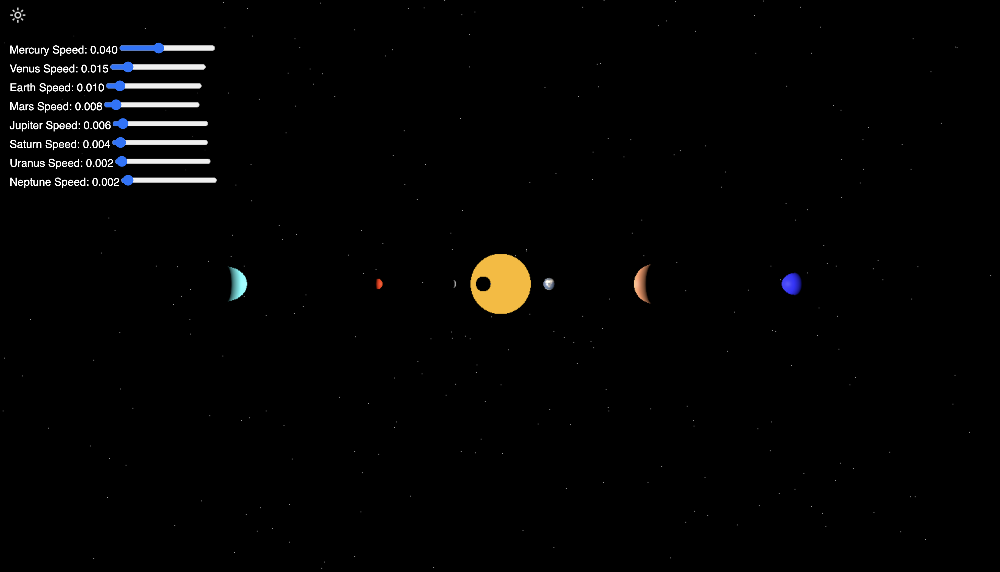
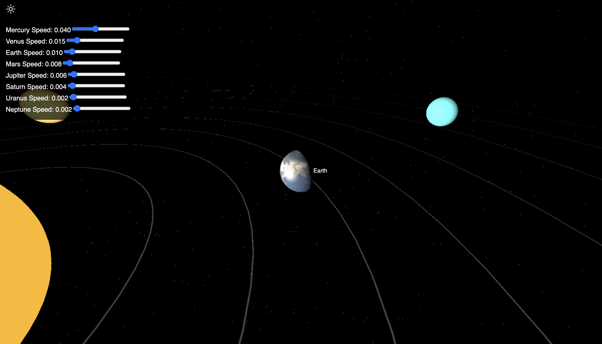
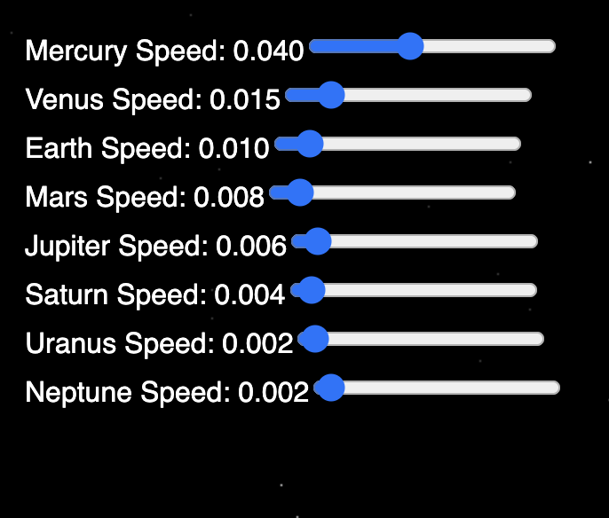
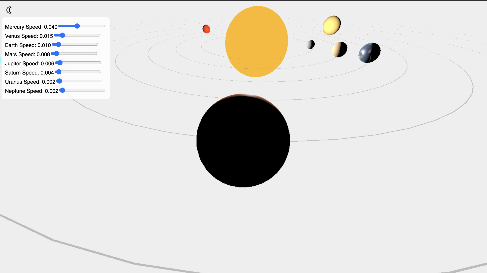
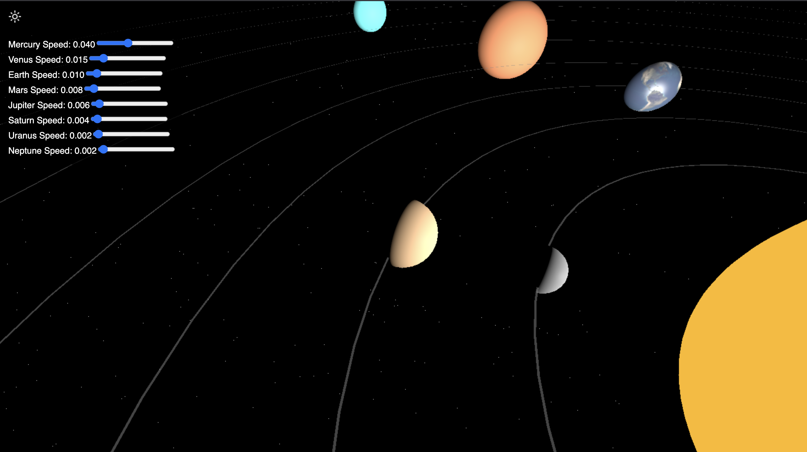

# 🌍 3D Solar System Simulation – Built with Three.js

This project is a 3D simulation of our Solar System, built using Three.js. It brings the planets to life with animations, textures, and interactive features  

---

## 🌟 What’s Inside

- A glowing sun at the center
- 8 beautiful, orbiting planets with realistic motion
- A slider to control each planet’s speed
- Hover tooltips that show planet names
- Click a planet to zoom in for a closer look
- A toggle switch to switch between dark & light themes (with sun/moon icons)
- Starry background to make it feel like space
- Fully responsive – works on all screen sizes

---

## 🛠️ Tech Stack

This project uses:

- HTML, CSS & JavaScript
- Three.js (for all the 3D magic ✨)

---

## 🗂️ Folder Structure

```
solar-system-3d/
│
├── index.html          # Main HTML file
├── script.js           # Contains all the 3D logic
├── style.css           # Styles for controls, layout, and themes
├── textures/           # Planet and earth texture images
│   ├── earth1.jpg
│   └── earth_specular_2048.jpg
├── sun.png             # Icon for light theme
├── moon.png            # Icon for dark theme
└── README.md           # This file
```

---

## 🧪 How to Run

1. Download or clone the project files.
2. Make sure you have the required images inside a folder named textures:
   - earth1.jpg (Earth texture)
   - earth_specular_2048.jpg (Earth’s lighting map)
3. Also include sun.png and moon.png in the root folder.
4. Open index.html in any modern browser — and you're good to go!

---
## 🌌 Screenshots

### Solar System Overview


### Planet Hover Tooltip


### Speed Control Sliders


### Theme Toggle - Dark and Light Modes


### Camera Focus on Clicked Planet



## 💡 What Can Be Improved

- Add textures for all planets
- Show planet info cards on click
- Add orbiting moons
- Include sound effects or space music 🌌

---

## 👨‍💻 About Me

Made with 💙 by  
Sai Charan Nethi  
B.Tech CSE, NIT Durgapur (Batch of 2027)
